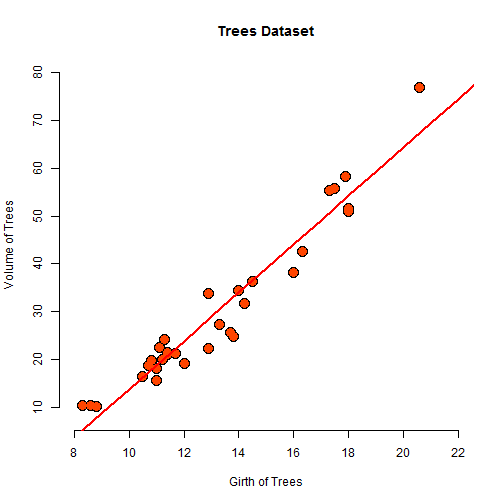

Simple Prediction App
========================================================
author: Vedant Mane
date: July 09, 2020
autosize: true

Overview
========================================================

The prediction application has been designed to predict the Volume of the tree based on the details of Girth of the Tree provided by the user.

```
[1] "Trees Dataset"
```

```
  Girth Height Volume
1   8.3     70   10.3
2   8.6     65   10.3
3   8.8     63   10.2
4  10.5     72   16.4
5  10.7     81   18.8
6  10.8     83   19.7
```
The application has been uploaded at the following link.
<https://vedantmane.shinyapps.io/predictionapp/>  


Model Trees
========================================================


```
     Girth           Height       Volume     
 Min.   : 8.30   Min.   :63   Min.   :10.20  
 1st Qu.:11.05   1st Qu.:72   1st Qu.:19.40  
 Median :12.90   Median :76   Median :24.20  
 Mean   :13.25   Mean   :76   Mean   :30.17  
 3rd Qu.:15.25   3rd Qu.:80   3rd Qu.:37.30  
 Max.   :20.60   Max.   :87   Max.   :77.00  
```

```
lm(formula = Volume ~ Girth, data = trees)
```

```
              Estimate Std. Error   t value     Pr(>|t|)
(Intercept) -36.943459   3.365145 -10.97827 7.621449e-12
Girth         5.065856   0.247377  20.47829 8.644334e-19
```

Model Plot & Coefficients
========================================================



***

<br>

```
[1] "Intercept :  -36.9434591245786"
```

```
[1] "Slope :  5.06585642284377"
```

Prediction
========================================================

Predicting some sample Girth values that may be selected from our app :


```
  Girth   Volume
1    10 13.71511
2    12 23.84682
3    14 33.97853
4    16 44.11024
5    18 54.24196
6    20 64.37367
```
